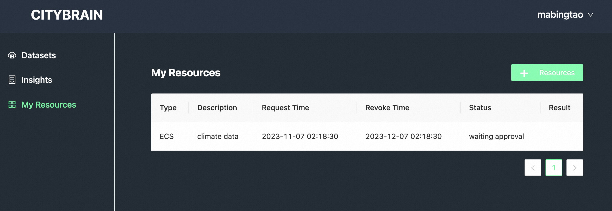

# 通过Citybrain平台加速科学研究

citybrain平台是一个构建在云上的科研平台，为科研人员提供强大的算力和稳定可靠的存储服务，平台提供科研领域开放数据，也鼓励用户参与数据共建。本文介绍如何使用平台来进行数据上传和计算。

## 开始

citybrain平台目前开放了网站和Python SDK，用户需要结合这两者来使用平台能力。在进行后续工作之前，请先注册平台账号。

### 注册账号

浏览器打开 [http://221.228.10.51:18080](http://221.228.10.51:18080/) ，网站目前未对公众开放，首次打开需要进行验证：用户名和密码均为`citybrain2023`。验证通过后进入网站首页

点击右上角 `Sign In`，弹窗内选择 `Register Now!` 进行注册，注册完成后登录。

### 申请虚拟机（可选）

数据开发过程通常涉及数据下载、数据预处理、数据计算、数据存储等步骤。首先需要评估初始数据的规模，如果个人电脑不能够满足下载、预处理的需求，citybrain平台提供多种规格配置的虚拟机帮助科研工作者完成这些工作。

网站在登录状态下点击首页 `GO TO` 进入个人工作台页面，点击左侧边栏 `My Resources` 菜单，进入虚拟机资源管理页面

点击 `+ Resources` 按钮，在弹出的规格配置表单中填写需要的规格大小和本次资源开通的描述信息，点击 `Apply` 按钮创建申请单

申请通过后在该页面申请单列表Result列可以查看到资源的SSH连接信息，通过个人电脑的SSH客户端（MacOS、Linux内置，Windows系统可使用putty等工具）远程登录，即可使用该虚拟机作为后续数据下载预处理等操作的环境。


### 安装Python SDK并获取API KEY

在个人电脑或开通的虚拟机中安装python3.7及以上的版本，命令行终端中执行
```sh
pip3 install --upgrade citybrain-platform
```
安装citybrain平台的Python SDK，等待下载安装即可。访问 [https://github.com/citybrain-platform/python-library](https://github.com/citybrain-platform/python-library) 查看SDK详细使用说明
安装完成后，使用之前注册的平台账号登录网站，点击右上角账户名下拉菜单，点击 `Settings` 进入个人设置页面，在ApiKey部分可查看当前账户的API KEY


### Python SDK初始化

使用Python SDK时需要首先配置前面拿到的API KEY，作为调用平台能力的用户凭证，请妥善保管。由于当前citybrain.org尚未对公众开放，该域名暂时无法访问，故需要额外设置SDK的平台API访问入口，代码如下
```python
import citybrain_platform

citybrain_platform.api_key = "put your api key here"
citybrain_platform.api_baseurl = "http://221.228.10.51:18080/platform/"
```

## 数据上传

通过个人电脑或citybrain平台提供的虚拟机完成数据的下载或预处理后，可以调用SDK提供的数据上传函数来保存数据，数据会被上传到对应账户的个人存储空间，示例代码如下
```python
import citybrain_platform

# 调用该函数上传数据
# remote_path参数用于指定目标文件在个人空间的相对路径
# local_file则是本地待上传文件的路径
res = citybrain_platform.Storage.upload_file(remote_path="testdir/testfile", local_file="test.localfile")
print(res)
```

同时SDK提供下载数据、删除数据和已上传数据列表函数，方便进行数据管理。

## 数据计算

citybrain平台提供强大的表格型数据计算能力，如何将数据处理成表格形式是利用好平台算力的关键。  
以气候数据为例，我们会构建这样一个表，表中每一行是特定时间的观测指标集合，可以是每1分钟的数据也可以是每天的数据，一行中的每一列表示一个观测指标，如温度、湿度等。取决于我们拿到的初始数据的大小，这个表的行数可能有几百行，也可能有数十亿行，在citybrian平台，我们无需担心表的数据量大小。

SDK提供两种方式用于构建表

### 1. 基于个人存储空间的指定数据目录来创建表

首先将待上传数据处理成csv或者parquet格式，并将数据上传到指定目录中

```python
import citybrain_platform

# 上传本地csv文件（不含表头），保存到个人空间下的dir_a目录
res = citybrain_platform.Storage.upload_file(remote_path="dir_a/data.csv", local_file="data.csv")
print(res)
```

创建数据表

```python
from citybrain_platform.computing.data_types import Column, ColumnType

# csv中数据有两列，第一列为字符串类型，第二列为整形数字，这里是表的schema定义
columns = [
    Column("col_a", ColumnType.STRING, "this is a comment"),
    Column("col_b", ColumnType.BIGINT),
]

# 创建表
ok = citybrain_platform.Computing.create_table(
    name="test_tblname", # 表名
    columns=columns, # 列定义
    description="test table", # 表注释
    storage_filesource="dir_a", # 存储在个人空间的数据目录
    storage_filetype=data_types.ExternalFiletype.CSV # 数据格式
)
print(ok)
```

### 2. 基于本地处理好的表格型数据来创建表

首先将数据处理成csv格式，创建表后直接上传数据到表中。  
这种方式建立的表，计算性能比基于存储空间文件建表的方式更好，建议使用该方式建表。

```python
import citybrain_platform
from citybrain_platform.computing.data_types import Column, ColumnType

# csv中数据有两列，第一列为字符串类型，第二列为整形数字，这里是表的schema定义
columns = [
    Column("col_str", ColumnType.STRING, "this is a comment"),
    Column("col_id", ColumnType.BIGINT),
]

# 创建表
ok = citybrain_platform.Computing.create_table(
    name="test_tblname", # 表名
    columns=columns, # 列定义
    description="test table" # 表注释
)
print(ok)

# 上传表数据
ok = citybrain_platform.Computing.upload_table_data(
  name="test_tblname", # 表名
  append=True, # 新增数据
  csv_filepath="data.csv" # 本地csv文件路径
)
print(ok)
```

同时SDK提供删除表、清空表等函数，方便进行数据表管理。

### 计算

建好数据表并上传数据后，通过构造SQL语句来对表数据进行计算，用户需要精心构造查询语句来表达需要进行的计算逻辑。  
citybrain平台上每一个SQL语句都被称作job，可以通过SDK创建和管理job。

```python
import citybrain_platform

# 创建计算job
job_id = citybrain_platform.Computing.create_job(
  sql="select avg(col_id) from test_tblname;" # sql语句
)
print(job_id)

# 查看job运行状态
job_status = citybrain_platform.Computing.get_job_status(
  job_id=job_id # 创建job函数返回的job id
)
print(job_status)

# job结束后下载计算结果
citybrain_platform.Computing.get_job_results(
  job_id=job_id, # 创建job函数返回的job id
  filepath="results.csv" # 结果数据保存到本地的文件路径
)

```
