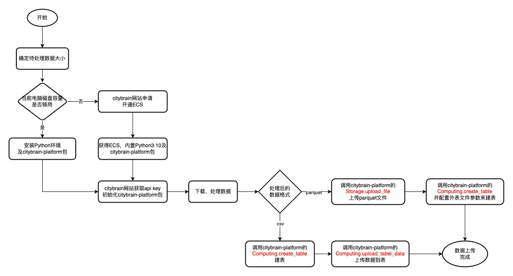
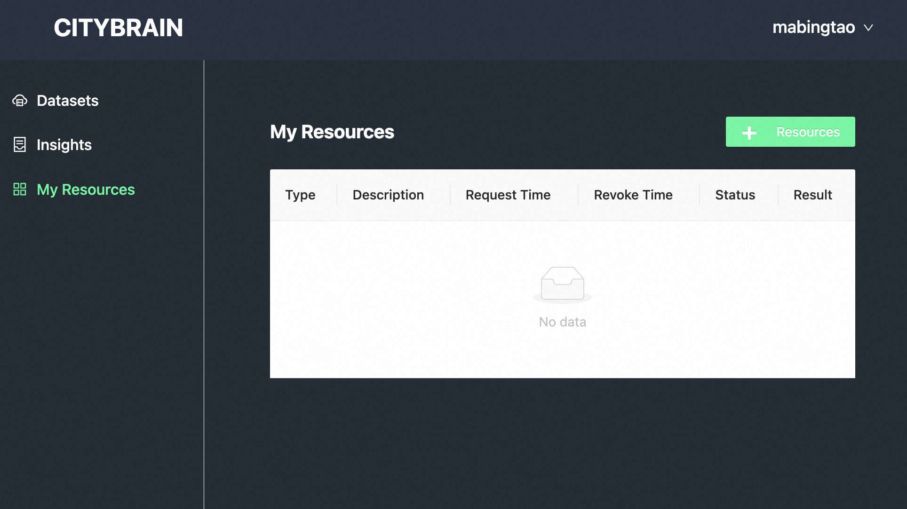
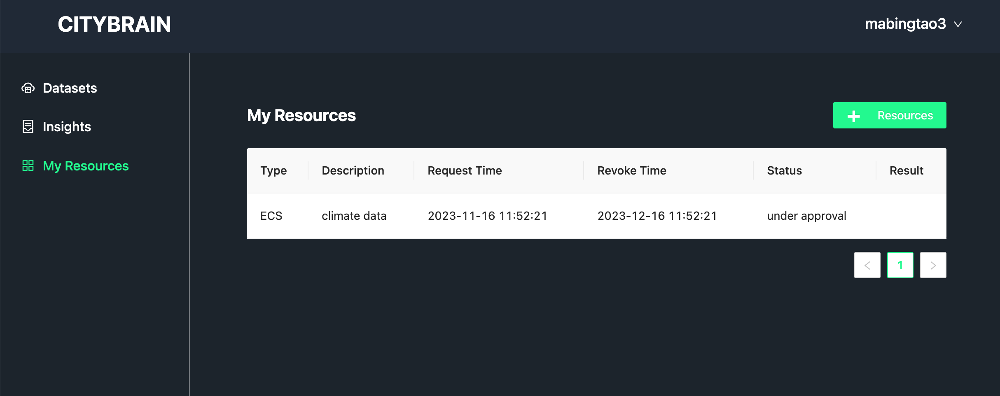
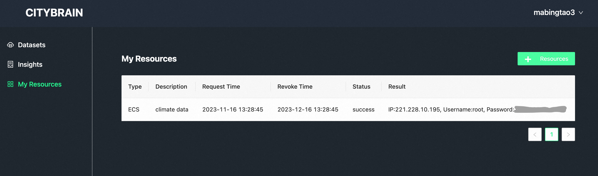
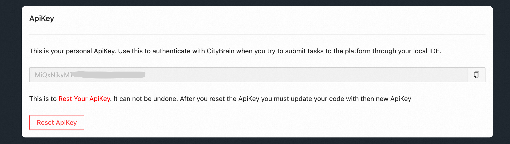

# 示例：用户如何在citybrain平台完成数据上传和计算

citybrain平台是一个构建在云上的科研平台，为科研人员提供强大的算力和稳定可靠的存储服务，平台提供科研领域开放数据，也鼓励用户参与数据共建。本文介绍如何使用平台来进行数据上传和计算。

## 开始

citybrain平台目前开放了网站和Python SDK，用户需要结合这两者来使用平台能力。在进行后续工作之前，请先注册citybrain平台账号。

### 注册账号

浏览器打开 [http://221.228.10.51:18080](http://221.228.10.51:18080/) ，网站目前未对公众开放，首次打开需要进行验证：用户名和密码均为`citybrain2023`。验证通过后进入网站首页

点击右上角 `Sign In`，弹窗内选择 `Register Now!` 进行注册，注册完成后登录。


## 数据上传

基本流程如下




在准备原始数据之前，需要先确认原始数据的规模，主要是总的文件的大小。在数据量较大的场景下，个人电脑的磁盘容量往往不够，这个时候需要向citybrain申请开通具备大容量磁盘的ECS（一种Linux虚拟机，详细介绍见 [What is ECS?](https://www.alibabacloud.com/help/en/ecs/product-overview/what-is-ecs)）

### 如何申请ECS（当您的个人电脑磁盘容量够用时可忽略）

网站在登录状态下点击首页 `GO TO` 进入个人工作台页面，点击左侧边栏 `My Resources` 菜单，进入虚拟机资源管理页面

点击 `+ Resources` 按钮，在弹出的规格配置表单中填写需要的规格大小和本次ECS开通的描述信息，点击 `Apply` 按钮发起申请创建审批单如下


> 审批过程预计在几分钟到几小时，取决于平台ECS可用余量，请耐心等待。审批通过后会发送邮件到您注册账号时填写的邮箱，请注意查收。

申请通过后在该页面可以查看到该ECS的SSH连接信息，通过个人电脑的SSH客户端（MacOS、Linux内置，Windows系统可使用putty等工具）远程登录，即可使用该ECS作为后续数据下载预处理等操作的环境


> 开通的ECS内置Miniconda环境，Python版本为3.10，已安装的Python package包括jupyter-hub、numpy、pandas、GDAL、Pillow等，citybrain-platform包也已预先安装。
>
> ECS所在集群位于中国境内江苏省无锡市。ECS默认保留一个月，过期自动回收

### 获取API KEY，初始化citybrain-platform包

登录网站，点击右上角账户名下拉菜单，点击 `Settings` 进入个人设置页面，在ApiKey部分可查看当前账户的API KEY


使用个人电脑时，请保证当前环境中已安装Python3.7及以上版本，并安装citybrain-platform包
```sh
pip3 install --upgrade citybrain-platform
```
使用Python包时需要首先配置前面拿到的API KEY，作为调用平台能力的用户凭证，请妥善保管。由于当前citybrain.org尚未对公众开放，该域名暂时无法访问，故需要额外设置SDK的平台API访问入口，代码如下
```python
import citybrain_platform

citybrain_platform.api_key = "Your API KEY"
citybrain_platform.api_baseurl = "http://221.228.10.51:18080/platform/"
```

> 访问 [https://github.com/citybrain-platform/python-library](https://github.com/citybrain-platform/python-library) 查看citybrain-platform包详细使用说明

### 下载并处理数据

通过个人电脑或citybrain平台提供的ECS完成数据下载和处理，处理后的数据要求是csv或者[parquet](https://github.com/apache/parquet-format)文件格式

### 上传数据到citybrain平台

> citybrain平台提供的计算和存储能力背后是表数据计算引擎和文件存储服务，其中表计算引擎基于MaxCompute([What is MaxCompute?](https://www.alibabacloud.com/help/en/maxcompute/product-overview/what-is-maxcompute))构建，文件存储服务基于OSS([What is OSS?](https://www.alibabacloud.com/help/zh/oss/product-overview/what-is-oss))构建。  
>
> *以气候数据为例，我们可能会构建这样一个表，表中每一行是特定时间的观测指标集合，可以是每1分钟的数据也可以是每天的数据，一行中的每一列表示一个观测指标，如温度、湿度等。取决于我们拿到的初始数据的大小，这个表的行数可能有几百行，也可能有数十亿行，在citybrian平台，我们无需担心表的数据量大小。*

目前我们支持两种文件格式上传数据到citybrain平台：
* csv文件(需要去除表头)，适用于数据量不大（小于1GB）的情况
* [parquet](https://github.com/apache/parquet-format)文件，适用于数据量较大（大于1GB）的情况


以下给出这两种文件格式上传的示例代码和注释：

**csv**

```python
import citybrain_platform
from citybrain_platform.computing.data_types import Column, ColumnType

# 表的列定义
columns = [
    Column("col_1", ColumnType.STRING, "this is a comment"),
    Column("col_2", ColumnType.BIGINT),
    ...
]

# 创建表
ok = citybrain_platform.Computing.create_table(
    name="test_tblname", # 表名
    columns=columns, # 列定义
    description="test table" # 表注释
)
print(ok)

# 上传csv数据到表
ok = citybrain_platform.Computing.upload_table_data(
  name="test_tblname", # 表名
  csv_filepath="data.csv" # 本地csv文件路径，csv中去除表头
)
print(ok)
```

**parquet**

```python
import citybrain_platform

store_dir = 'dir_1' # 目录

# 上传本地parquet文件到存储服务
res = citybrain_platform.Storage.upload_file(remote_path=f"{store_dir}/data.zip", local_file="data.zip")
print(res)

# 表的列定义
columns = [
    Column("col_a", ColumnType.STRING, "this is a comment"),
    Column("col_b", ColumnType.BIGINT),
    ...
]

# 创建表，指定已上传文件作为数据源
ok = citybrain_platform.Computing.create_table(
    name="test_tblname", # 表名
    columns=columns, # 列定义
    description="test table", # 表注释
    storage_filesource=store_dir, # 数据目录
    storage_filetype=data_types.ExternalFiletype.PARQUET # 数据格式
)
print(ok)
```

创建的表默认是public权限，平台用户可以通过citybrain-platform包的 `Storage.list_tables()` 列出所有public的表，对他人创建的表只能读不能修改。

## 数据计算

建好数据表并上传数据后，需要使用SQL来与计算引擎交互，您需要精心构造查询语句来表达需要进行的计算逻辑。  
citybrain平台上每一个SQL语句都被称作job，可以通过citybrain-platform包来创建和管理job，示例代码如下

```python
import citybrain_platform
from citybrain_platform import JobStatus

# 创建计算job
job_id = citybrain_platform.Computing.create_job(
  sql="select avg(col_id) from test_tblname;" # sql语句
)
print(job_id)

# 查看job运行状态
job_status = citybrain_platform.Computing.get_job_status(
  job_id=job_id # 创建job函数返回的job id
)
print(job_status)

# job结束后下载计算结果数据(csv格式)
if (job_status.status == JobStatus.Terminated) {
  citybrain_platform.Computing.get_job_results(
    job_id=job_id, # 创建job函数返回的job id
    filepath="results.csv" # 结果数据保存到本地的文件路径
  )
}
```
